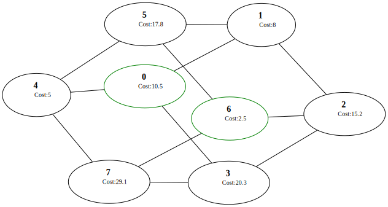

Решение задачи про размещении военных баз на секторах:

Некоторая территория разделена на n секторов. Предполагается, что военная база, расположенная в каком-то секторе, может контролировать не только этот сектор, но и соседние, граничащие с ним. Каждый сектор характеризуется определёнными убытками, связанными с расположением на нём военной базы.
Требуется найти такие места размещения военных баз, чтобы суммарные убытки были минимальные и вся территория была под контролем.

Dependencies: cargo
Использованы крейты:
	- serde "1.0.219"
	- serde_json "1.0.143"

Как пользоваться:
	Программа запускается командой cargo run в директории программы. Программа считывает файл graph.json и выводит в стандартный поток информацию о наилучшей конфигурации и реализацию графа лучшей реализации на языке DOT.
	Выхлоп программы легко записать в .gv файл :
		cargo run > _имя_файла_.gv
	Далее этот файл можно преобразовать в изображение при помощи graphviz.
	На графе сектора с базой имеют зелёную обводку, без - чёрную. Рёбра графа отражают соседство между двумя секторами
	